# OurEvent Platform - Database Schema

> مخطط قاعدة البيانات الكامل لمنصة فعالياتنا

## Entity Relationship Diagram

```mermaid
erDiagram
    USERS {
        uuid id PK
        string email
        string password_hash
        string name
        string phone
        string avatar_url
        string role
        boolean is_verified
        boolean is_active
        datetime created_at
        datetime updated_at
    }

    USER_SESSIONS {
        uuid id PK
        uuid user_id FK
        string token
        string device_info
        string ip_address
        datetime expires_at
        datetime created_at
    }

    ORGANIZERS {
        uuid id PK
        uuid user_id FK
        string company_name
        string company_name_ar
        string email
        string phone
        string logo_url
        string description
        string website
        boolean is_verified
        decimal rating
        int total_events
        decimal total_revenue
        string status
        datetime created_at
        datetime updated_at
    }

    ORGANIZER_DOCUMENTS {
        uuid id PK
        uuid organizer_id FK
        string name
        string file_url
        string file_type
        int file_size
        string document_type
        datetime created_at
    }

    REGIONS {
        uuid id PK
        string name
        string name_ar
        string code
        boolean is_active
        datetime created_at
    }

    CITIES {
        uuid id PK
        uuid region_id FK
        string name
        string name_ar
        string code
        decimal latitude
        decimal longitude
        string timezone
        boolean is_active
        int sort_order
        datetime created_at
    }

    VENUES {
        uuid id PK
        uuid city_id FK
        uuid organizer_id FK
        string name
        string name_ar
        string description
        string address
        decimal latitude
        decimal longitude
        int capacity
        string contact_phone
        string contact_email
        boolean is_verified
        boolean is_active
        datetime created_at
        datetime updated_at
    }

    VENUE_IMAGES {
        uuid id PK
        uuid venue_id FK
        string image_url
        string alt_text
        boolean is_primary
        int sort_order
        datetime created_at
    }

    VENUE_AMENITIES {
        uuid id PK
        uuid venue_id FK
        string name
        string name_ar
        string icon
        datetime created_at
    }

    EVENT_TYPES {
        uuid id PK
        string name
        string name_ar
        string slug
        string description
        string icon
        string color
        boolean is_active
        int sort_order
        datetime created_at
        datetime updated_at
    }

    EVENT_TAGS {
        uuid id PK
        string name
        string name_ar
        string slug
        datetime created_at
    }

    EVENTS {
        uuid id PK
        uuid organizer_id FK
        uuid type_id FK
        uuid venue_id FK
        uuid city_id FK
        string title
        string title_ar
        string slug
        text description
        string short_description
        string cover_image_url
        string address
        decimal latitude
        decimal longitude
        datetime date_start
        datetime date_end
        datetime registration_start
        datetime registration_end
        int max_attendees
        int current_attendees
        boolean is_paid
        decimal min_price
        decimal max_price
        text terms_and_conditions
        text refund_policy
        string status
        boolean is_featured
        int views_count
        int likes_count
        datetime published_at
        datetime created_at
        datetime updated_at
        datetime deleted_at
    }

    EVENT_IMAGES {
        uuid id PK
        uuid event_id FK
        string image_url
        string thumbnail_url
        string alt_text
        boolean is_cover
        int sort_order
        datetime created_at
    }

    EVENT_ATTACHMENTS {
        uuid id PK
        uuid event_id FK
        string name
        string file_url
        string file_type
        int file_size
        boolean is_public
        int download_count
        datetime created_at
    }

    EVENT_TAG_MAPPING {
        uuid id PK
        uuid event_id FK
        uuid tag_id FK
        datetime created_at
    }

    TICKET_TIERS {
        uuid id PK
        uuid event_id FK
        string name
        string name_ar
        string type
        text description
        decimal price
        decimal original_price
        int quantity
        int sold
        int reserved
        int max_per_order
        int min_per_order
        datetime sale_start
        datetime sale_end
        boolean is_active
        int sort_order
        datetime created_at
        datetime updated_at
    }

    TICKET_TIER_BENEFITS {
        uuid id PK
        uuid tier_id FK
        string benefit
        string benefit_ar
        string icon
        int sort_order
        datetime created_at
    }

    TICKETS {
        uuid id PK
        uuid event_id FK
        uuid tier_id FK
        uuid user_id FK
        uuid registration_id FK
        uuid order_id FK
        string ticket_number
        string qr_code
        string barcode
        string attendee_name
        string attendee_email
        string attendee_phone
        string seat_number
        string seat_section
        decimal price
        decimal discount_amount
        string status
        datetime checked_in_at
        uuid checked_in_by
        datetime cancelled_at
        datetime refunded_at
        decimal refund_amount
        text notes
        datetime created_at
        datetime updated_at
    }

    ORDERS {
        uuid id PK
        uuid user_id FK
        uuid event_id FK
        string order_number
        decimal subtotal
        decimal discount_amount
        decimal service_fee
        decimal tax_amount
        decimal total_amount
        string currency
        string status
        string payment_status
        string payment_method
        string payment_gateway
        string gateway_transaction_id
        string billing_name
        string billing_email
        string billing_phone
        string coupon_code
        string ip_address
        text notes
        datetime paid_at
        datetime cancelled_at
        datetime refunded_at
        datetime expires_at
        datetime created_at
        datetime updated_at
    }

    ORDER_ITEMS {
        uuid id PK
        uuid order_id FK
        uuid tier_id FK
        int quantity
        decimal unit_price
        decimal total_price
        decimal discount_amount
        datetime created_at
    }

    PAYMENTS {
        uuid id PK
        uuid order_id FK
        uuid user_id FK
        decimal amount
        string currency
        string payment_method
        string gateway
        string gateway_transaction_id
        string card_last_four
        string card_brand
        string status
        text failure_reason
        string refund_id
        decimal refund_amount
        datetime refunded_at
        datetime created_at
        datetime updated_at
    }

    REFUNDS {
        uuid id PK
        uuid order_id FK
        uuid payment_id FK
        uuid user_id FK
        uuid processed_by FK
        decimal amount
        text reason
        string status
        string gateway_refund_id
        text admin_notes
        datetime processed_at
        datetime created_at
        datetime updated_at
    }

    REGISTRATIONS {
        uuid id PK
        uuid event_id FK
        uuid user_id FK
        uuid order_id FK
        string registration_number
        int attendee_count
        decimal total_amount
        string status
        string payment_status
        string check_in_status
        datetime checked_in_at
        datetime checked_out_at
        string source
        text notes
        datetime created_at
        datetime updated_at
    }

    COUPONS {
        uuid id PK
        uuid organizer_id FK
        uuid event_id FK
        string code
        string name
        text description
        string discount_type
        decimal discount_value
        decimal max_discount
        decimal min_order_amount
        int max_uses
        int max_uses_per_user
        int used_count
        datetime starts_at
        datetime expires_at
        boolean is_active
        datetime created_at
        datetime updated_at
    }

    COUPON_USAGE {
        uuid id PK
        uuid coupon_id FK
        uuid user_id FK
        uuid order_id FK
        decimal discount_amount
        datetime created_at
    }

    FAVORITES {
        uuid id PK
        uuid user_id FK
        uuid event_id FK
        datetime created_at
    }

    EVENT_VIEWS {
        uuid id PK
        uuid event_id FK
        uuid user_id FK
        string session_id
        string ip_address
        string referrer
        datetime created_at
    }

    REVIEWS {
        uuid id PK
        uuid event_id FK
        uuid user_id FK
        uuid registration_id FK
        int rating
        string title
        text comment
        boolean is_verified
        boolean is_visible
        text admin_response
        datetime created_at
        datetime updated_at
    }

    NOTIFICATIONS {
        uuid id PK
        uuid user_id FK
        string type
        string title
        string title_ar
        text message
        text message_ar
        string action_url
        boolean is_read
        datetime read_at
        datetime created_at
    }

    NOTIFICATION_PREFERENCES {
        uuid id PK
        uuid user_id FK
        boolean email_new_events
        boolean email_event_reminders
        boolean email_promotions
        boolean email_newsletter
        boolean push_new_events
        boolean push_event_reminders
        boolean push_order_updates
        boolean sms_event_reminders
        datetime created_at
        datetime updated_at
    }

    ADMIN_ACTIVITY_LOGS {
        uuid id PK
        uuid admin_id FK
        string action
        string entity_type
        uuid entity_id
        string ip_address
        datetime created_at
    }

    SYSTEM_SETTINGS {
        uuid id PK
        string key
        text value
        string type
        string group_name
        text description
        boolean is_public
        uuid updated_by FK
        datetime created_at
        datetime updated_at
    }

    PAYOUTS {
        uuid id PK
        uuid organizer_id FK
        decimal amount
        string currency
        string bank_name
        string bank_iban
        string bank_account_name
        string status
        string reference_number
        text notes
        uuid processed_by FK
        datetime processed_at
        datetime created_at
        datetime updated_at
    }

    USERS ||--o{ USER_SESSIONS : has
    USERS ||--o| ORGANIZERS : becomes
    USERS ||--o{ ORDERS : places
    USERS ||--o{ TICKETS : owns
    USERS ||--o{ REGISTRATIONS : makes
    USERS ||--o{ FAVORITES : has
    USERS ||--o{ REVIEWS : writes
    USERS ||--o{ NOTIFICATIONS : receives
    USERS ||--o| NOTIFICATION_PREFERENCES : has

    ORGANIZERS ||--o{ EVENTS : creates
    ORGANIZERS ||--o{ ORGANIZER_DOCUMENTS : has
    ORGANIZERS ||--o{ VENUES : owns
    ORGANIZERS ||--o{ COUPONS : creates
    ORGANIZERS ||--o{ PAYOUTS : receives

    REGIONS ||--o{ CITIES : contains
    CITIES ||--o{ VENUES : has
    CITIES ||--o{ EVENTS : hosts

    VENUES ||--o{ VENUE_IMAGES : has
    VENUES ||--o{ VENUE_AMENITIES : has
    VENUES ||--o{ EVENTS : hosts

    EVENT_TYPES ||--o{ EVENTS : categorizes
    EVENT_TAGS ||--o{ EVENT_TAG_MAPPING : has

    EVENTS ||--o{ EVENT_IMAGES : has
    EVENTS ||--o{ EVENT_ATTACHMENTS : has
    EVENTS ||--o{ EVENT_TAG_MAPPING : has
    EVENTS ||--o{ TICKET_TIERS : offers
    EVENTS ||--o{ ORDERS : generates
    EVENTS ||--o{ REGISTRATIONS : has
    EVENTS ||--o{ FAVORITES : receives
    EVENTS ||--o{ EVENT_VIEWS : has
    EVENTS ||--o{ REVIEWS : receives
    EVENTS ||--o{ COUPONS : has

    TICKET_TIERS ||--o{ TICKET_TIER_BENEFITS : has
    TICKET_TIERS ||--o{ TICKETS : generates
    TICKET_TIERS ||--o{ ORDER_ITEMS : contains

    ORDERS ||--o{ ORDER_ITEMS : contains
    ORDERS ||--o{ PAYMENTS : has
    ORDERS ||--o{ TICKETS : generates
    ORDERS ||--o{ REFUNDS : has
    ORDERS ||--o| REGISTRATIONS : creates
    ORDERS ||--o{ COUPON_USAGE : uses

    COUPONS ||--o{ COUPON_USAGE : tracked_by
```



---

## 📊 Database Tables Summary

| Category | Tables | Description |
|----------|--------|-------------|
| 👤 **Users & Auth** | `users`, `user_sessions` | User management and authentication |
| 🏢 **Organizers** | `organizers`, `organizer_documents` | Event organizer management |
| 📍 **Geographic** | `regions`, `cities`, `venues`, `venue_images`, `venue_amenities` | Location and venue management |
| 🏷️ **Event Types** | `event_types`, `event_tags` | Event categorization |
| 🎉 **Events** | `events`, `event_images`, `event_attachments`, `event_tag_mapping` | Core event data |
| 🎫 **Tickets** | `ticket_tiers`, `ticket_tier_benefits`, `tickets` | Ticketing system |
| 🛒 **Orders** | `orders`, `order_items`, `payments`, `refunds` | Order and payment processing |
| 📝 **Registrations** | `registrations` | Event registrations |
| 🎁 **Coupons** | `coupons`, `coupon_usage` | Discount and promotion system |
| ❤️ **User Interactions** | `favorites`, `event_views`, `reviews` | User engagement tracking |
| 🔔 **Notifications** | `notifications`, `notification_preferences` | Notification system |
| ⚙️ **Admin** | `admin_activity_logs`, `system_settings`, `payouts` | System administration |

---

## 🔑 Key Indexes

```sql
-- Users
CREATE INDEX idx_users_email ON users(email);
CREATE INDEX idx_users_role ON users(role);

-- Events
CREATE INDEX idx_events_organizer ON events(organizer_id);
CREATE INDEX idx_events_city ON events(city_id);
CREATE INDEX idx_events_type ON events(type_id);
CREATE INDEX idx_events_status ON events(status);
CREATE INDEX idx_events_date_start ON events(date_start);
CREATE INDEX idx_events_is_featured ON events(is_featured);
CREATE UNIQUE INDEX idx_events_slug ON events(slug);

-- Tickets
CREATE INDEX idx_tickets_event ON tickets(event_id);
CREATE INDEX idx_tickets_user ON tickets(user_id);
CREATE INDEX idx_tickets_status ON tickets(status);
CREATE UNIQUE INDEX idx_tickets_number ON tickets(ticket_number);
CREATE UNIQUE INDEX idx_tickets_qr ON tickets(qr_code);

-- Orders
CREATE INDEX idx_orders_user ON orders(user_id);
CREATE INDEX idx_orders_event ON orders(event_id);
CREATE INDEX idx_orders_status ON orders(status);
CREATE UNIQUE INDEX idx_orders_number ON orders(order_number);

-- Favorites
CREATE UNIQUE INDEX idx_favorites_user_event ON favorites(user_id, event_id);
```

---

## 📋 Status Enums

### User Roles
| Value | Description |
|-------|-------------|
| `admin` | System administrator |
| `organizer` | Event organizer |
| `user` | Regular user |

### Event Status
| Value | Description |
|-------|-------------|
| `draft` | Not published yet |
| `pending` | Awaiting approval |
| `published` | Live and visible |
| `closed` | Registration closed |
| `completed` | Event finished |
| `cancelled` | Event cancelled |

### Ticket Status
| Value | Description |
|-------|-------------|
| `active` | Valid for entry |
| `used` | Already checked in |
| `cancelled` | Cancelled by user |
| `expired` | Past event date |
| `refunded` | Money returned |

### Order Status
| Value | Description |
|-------|-------------|
| `pending` | Awaiting payment |
| `processing` | Payment in progress |
| `completed` | Successfully paid |
| `cancelled` | Order cancelled |
| `refunded` | Fully refunded |

### Payment Status
| Value | Description |
|-------|-------------|
| `pending` | Not paid yet |
| `paid` | Successfully paid |
| `failed` | Payment failed |
| `refunded` | Refunded |

---

## 🔒 Security Notes

- **Passwords**: Stored as bcrypt hashes
- **Tokens**: Secure random generation
- **UUIDs**: Prevent enumeration attacks
- **Soft Deletes**: `deleted_at` column
- **Audit Trail**: All admin actions logged

---

## 🌍 Internationalization

All user-facing text fields have Arabic counterparts:
- `name` / `name_ar`
- `description` / `description_ar`
- `title` / `title_ar`
- `message` / `message_ar`
